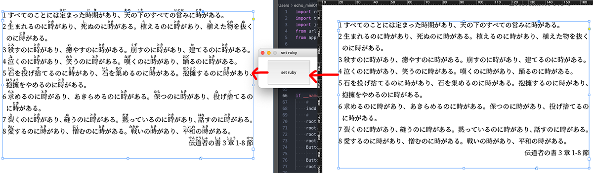

# use case
Yahooのルビ振りAPIを使用して、日本語漢字にルビを振る
## 参考API(V2)&サンプルコード：
- https://developer.yahoo.co.jp/webapi/jlp/furigana/v2/furigana.html
- https://developer.yahoo.co.jp/webapi/jlp/sample/sample10.html

# usage
YahooにてAPI KEYを申し込む（無料）、10行目を差し替え
```
APPID = "***** replace your app id here *****"
```
1. pyスクリプト起動
1. InDesignドキュメント上のテキストフレームを選択（複数可）
1. 「set ruby」ボタンをクリック

# example


# code:
- [03_set_ruby_to_textframe](03_set_ruby_to_textframe.py)